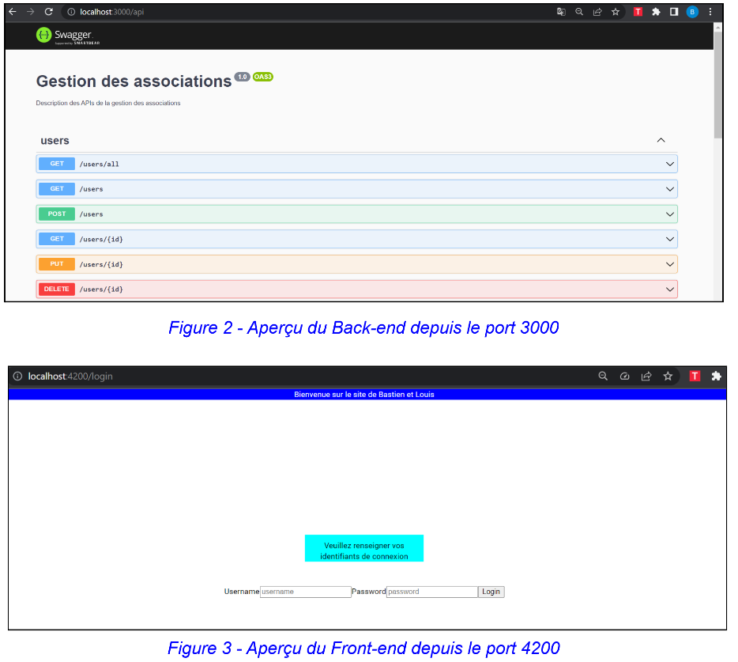

<h1 align="center">API REST du gestionnaire d'associations (Back)</h1>

## Exigences

- Node.js

## En cours d'exécution

```bash
npm run build
npm run start
```

Le Back-End se trouve dans le dossier fr-administration (équivalent au backend.zip avec le dossier node_modules dedans).

Le développement du Back-End est fait avec NestJS.
Le langage TypeScript est utilisé dans le but de gérer les controllers, services et modules.

La description des APIs de la gestion des associations de notre projet est disponible à l’adresse suivante (une fois que le back-end est lancé) :
http://localhost:3000/api

## Architecture du projet 🏛️

Sur http://localhost:3000/api on peut trouver plusieurs rubriques comme 
- users
- associations avec la possibilité de 
- POST (ajouter) des utilisateurs
- de GET pour les visualiser. Il y a également des 
- getters 
- des setters 
- ainsi que la possibilité de supprimer les utilisateurs et associations par exemple. 
- On peut aussi récupérer les identifiants et membres d'associations.

Dans fr-administration il y a un dossier source et un dossier test qui contient les fichiers .sh en partie.
Dans le fichier source on peut trouver 5 services : associations, auth, minutes, roles et users.

<h1 align="center">Navigation dans le front end (Description à titre informatif comme celle du Back, pas vraiment utile en soit pour le projet de POA) </h1>

Le front-end se trouve dans le dossier fr-administration-front de ce dépôt.

Pour le développement du Front-End, cela est fait avec Angular. 
Les langages utilisés TypeScript, HTML, et CSS afin de gérer les connexions, l’affichage de texte, l’affichage des boutons, et l’esthétique du site web. 

Le site est disponible à l’adresse suivante (une fois que le back-end et le front-end sont lancés) :
http://localhost:4200

Cette adresse amène directement sur la page de connexion :
http://localhost:4200/login
Il est ainsi possible de se connecter avec l’identifiant 1 et le mot de passe password.

Si la connexion est validée, on arrive sur la page suivante :
http://localhost:4200/users 
Une barre de navigation située en haut de la page permet d’effectuer les actions suivantes:
- utilisateurs
- associations, qui permet de créer une nouvelle association, ou de visualiser (disponible également depuis l’adresse http://localhost:4200/associations)
- déconnexion, si l’on clique dessus, cela nous ramène directement sur la page d’accueil (http://localhost:4200/login) 

Sur la fin de la barre de navigation, nous avons une icône permettant d’effectuer des recherches (disponible à l’adresse http://localhost:4200/search)
Sur ce lien, on peut retrouver à la fois la liste des utilisateurs et la liste des associations.

Nous pouvons également créer un nouvel utilisateur depuis le lien http://localhost:4200/signin.
Ce lien amène directement sur un formulaire qui demande le nom, le prénom et l'âge de la personne.
Une fois l'utilisateur créé, il est directement ajouté à la liste des utilisateurs.

Pour obtenir les informations sur un utilisateur, il faut se rendre à l'adresse suivante:
http://localhost:4200/user/id
avec id étant le numéro d'identifiant de l'utilisateur.

## Architecture

Pour l'architecture, on a les composants suivants :
- association, pour gérer les informations
- association-form, pour créer une association
- association-list, pour afficher la liste des associations
- guards, pour la sécurité de l'accès aux données
- login, pour la page d'accueil de connexion
- nav, pour la barre de navigation située en haut de notre page
- search, pour effectuer des recherches sur des utilisateurs ou des associations
- signin, pour créer un nouvel utilisateur
- user, pour accéder aux informations de l'utilisateur
- user-list, pour accéder à la liste des utilisateurs
  

